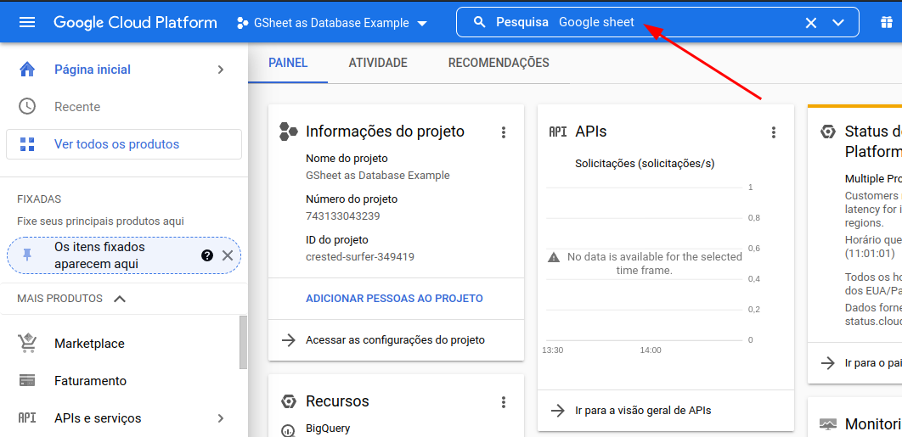
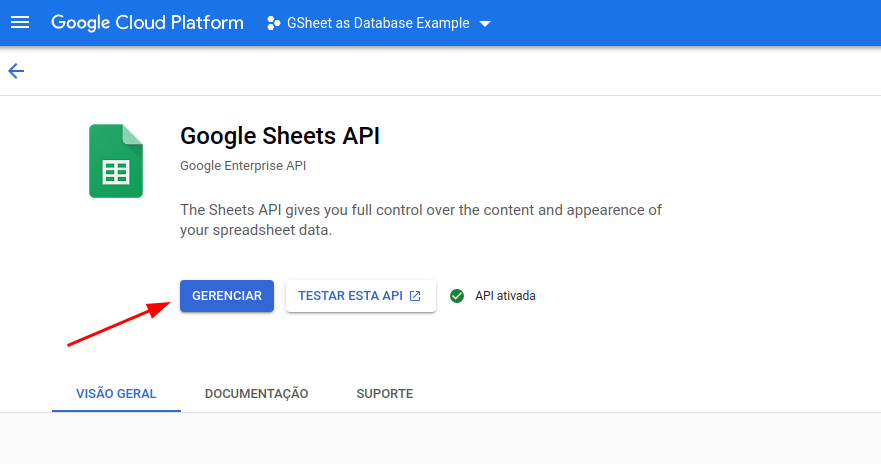
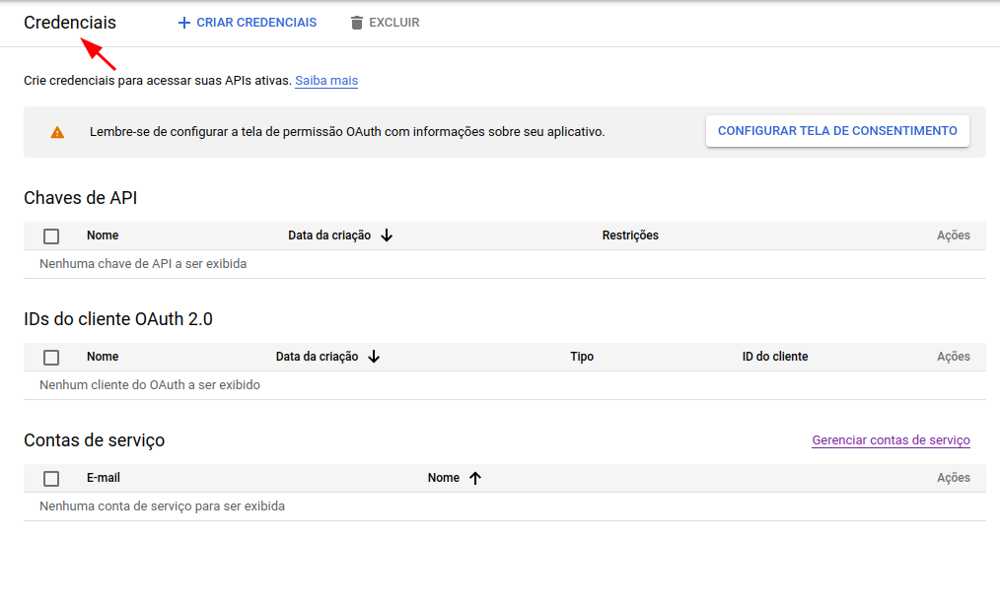
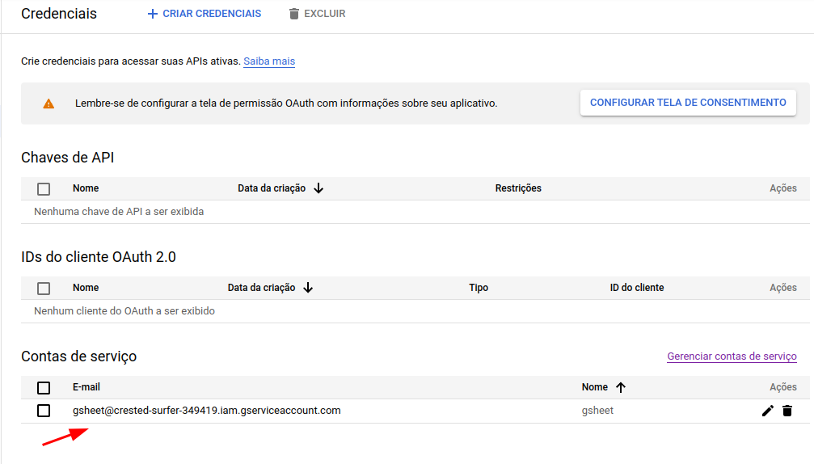
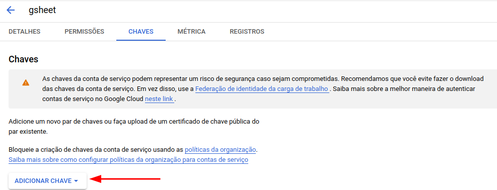

# Google Sheets Query Finder

Pequeno tutorial de como criar uma fazer um sistema de busca de uma base de dados no Google Sheets usando a [Google Sheets API](https://developers.google.com/sheets/api/guides/concepts).

Este tutorial é baseado no vídeo do [Fire Ship](https://fireship.io/lessons/google-sheets-database-nextjs/).

## Base de teste

Para testar o conceito do exemplo será utilizada a base de dados [Dark Souls 3 Weapons](https://www.kaggle.com/datasets/l3llff/-dark-souls-3-weapon), disponível no **Kaggle**. A base contém informações sobre as armas do jogo **Dark Souls III** com um total de 287 armas e 17 colunas. A base de dados pode ser encontrada [aqui](https://www.kaggle.com/datasets/l3llff/-dark-souls-3-weapon).

Esta base de dados foi escolhida por ser pequena, de simples entendimento e está bem documentada. O arquivo original do Kaggle está no formato CSV e tem a descrição de cada coluna (em inglês). Algumas dessas colunas serão utilizadas nesse exemplo.


> Imagem de um conjunto de armas do dataset escolhido para este exemplo. **Fonte:** [Dark Soul 3 Weapons (Kaggle)](https://www.kaggle.com/datasets/l3llff/-dark-souls-3-weapon).

A Database foi salva num arquivo **Google Sheets** e foi tornada **pública** através do link abaixo:

> https://docs.google.com/spreadsheets/d/1-eeEwPbFubO4cYiIerHPaB2BN90sihb7sOTvekqa5Iw/edit?usp=sharing

## Aplicativo

Para acessar os dados da Database deve-se um _Crud_ (Um site) através da tecnologia **Next JS*** como _front end_

> \* Na prática pode-se utilizar qualquer tecnologia web que permita uma programação razoável, eu escolhi o Next JS

### Criação do projeto Next

Seguiremos os seguintes passos para criar o projeto Next:

```bash
npx create-next-app google-sheet-dashboard
```
Os detalhes do site estão disponíveis no repositóri

### Criando uma Google API

Para o aplicativo Next acessar os dados da planilha é necessário ter uma Google API autenticada para o projeto.

O processo de criação da Google API é um pouco complexo e é atualizado de tempos em tempos, contudo de todo o processo pode ser feito através da plataforma **Google Cloud**:

> https://console.cloud.google.com

Em resumo existem duas formas de usar a Google API:

1. `Service Account` - Permite acesso apenas aos seus próprios dados de usuário
2. `OAUTH2` - Permite o acesso de dados de outros usuários

Como a planilha está salva na nossa conta utilizaremos o **`Service Account`**.

Finalmente, a criação de uma Google API é relativamente complexa, mas está detalhadamente explicada aqui:

> https://blog.coupler.io/how-to-use-google-sheets-as-database/

#### Criação da API

1. Procure por `Google Sheets API` e ative-a



2. Clique em `Manage`



#### Criação da credencial

Crie uma nova credencial:



#### Criação da chave secreta

1. Selecione a conta de serviço:



2. Procure por chave e crie uma chave JSON e salve no `root` do Next App



**Não se esqueça de adicionar a chave ao git ignore!!! Pois pode caso alguém tenha acesso a chave poderá acessar o seu Google Cloud Plataform**

#### Incorporando a chave ao Next App

1. Crie um arquivo chamado `.env.local`

2. Neste arquivo adicione o **caminho da chave** o `SHEET_ID`

    ```bash
    GOOGLE_APPLICATION_CREDENTIAL=./secret.json
    SHEET_ID=1-eeEwPbFubO4cYiIerHPaB2BN90sihb7sOTvekqa5Iw
    ```

    

    Procure por Google Sheets API

1. 

2. Instalar o pacote do Google API para simplificar o processo de autenticação e acesso a planilha:

```bash
npm install 
```


